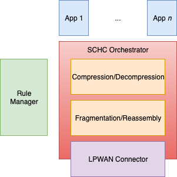

# SCHC Implementation (for micropython and Python).

This document's objective is to provide pointers that could help one to test the
SCHC protocol using the OpenSCHC implementation.
ToDo - See branches [here](https://github.com/openschc/openschc/network).

##  openschc
OpenSCHC (Static Context Header Compression) is an open implementation of the
[SCHC
protocol](https://datatracker.ietf.org/doc/draft-ietf-lpwan-ipv6-static-context-hc/?include_text=1).
which is licensed under the [MIT
License](https://github.com/openschc/openschc/blob/master/LICENSE)

Further information about OpenSCHC
[here](https://github.com/openschc/openschc/wiki)

## Understanding the Architecture
A holistic architecture  of the SCHC is shown below:



The *Rule Manager* defines the rule which is composed of two elements:
* A *ruleid* defines the rule number and
* A *content* which contains an array of fields. For details refer to [SCHC
* protocol](https://datatracker.ietf.org/doc/draft-ietf-lpwan-ipv6-static-context-hc/?include_text=1)

The *App 1.. App n* indicates the devices (either end-nodes or gateway) which
uses the *SCHC Orchestrator* to run the necessary SCHC operations briefly
defined below:
consumes the rules.

*Compression/Decompression* is used by the App, to compress the packet header
using a specific rule (whch is the rule ID) and upon receipt the C/D
infrastructure decompresses the
packet header based on the same rule.

Similarly *Fragmentation/Reassembly* is done based on the Rule ID and other
fields which could be referred to the [SCHC
protocol](https://datatracker.ietf.org/doc/draft-ietf-lpwan-ipv6-static-context-hc/?include_text=1)

*LPWAN Connector* is the LPWAN technology such as LoRa, Sigfox used for
communication in the LPWAN.

## Setting up the environment using python
Step 1 : You need to have a minimum of Python version "3" implemented. Check
your python version with the following command and update the python version, if
necessary
```sh
   python --version
```
Step 2: Clone the [OpenSCHC repository](https://github.com/openschc/openschc)

Step 3: For testing a hello world type using SCHC with different scenarios is
explained [here](https://github.com/openschc/openschc/blob/master/src/README.md)

## Setting up the environment using micro-python
Micropython is Python for microcontrollers. But one can install it in one's
distribution and emulate a microcontroller. In the context of SCHC, micro-python
is needed to flash the software in the end-devices.

Step 1: Need to install micro-python on the device. Some pointers are indicated
below. For more details, please refer to the proper documentation:
* For Linux distribs (it should be noted that this have not been tested on all
Linux distribs)
  * Micropython GitHub project :
  * ```https://github.com/micropython/micropython```
  * Specific instructions for the Unix port of micropython :
  * ```https://github.com/micropython/micropython#the-unix-version```
* On OSX
  * ```https://github.com/micropython/micropython/wiki/Micro-Python-on-Mac-OSX```
  * With brew ```brew install micropython```
  * On OS X, if you get an error message about missing libffi, try the fix
  * described in
  * ```https://stackoverflow.com/questions/22875270/error-installing-bcrypt-with-pip-on-os-x-cant-find-ffi-h-libffi-is-installed/25854749#25854749```

Step 2: Port the SCHC code.
* Add a module to micropython: ```./micropython -m upip install
* MICROPYTHON_MODULE```
* Libs are located under ```~/.micropython/lib```
* Modules to be ported for SCHC
  * argparse.py : ```./micropython -m upip install micropython-argparse```
  * copy.py : ```./micropython -m upip install micropython-copy```
  * ipaddress.py : ```./micropython -m upip install micropython-ipaddress```

Step 3: Test the SCHC C/D and F/R

* Simulate a simple ICMPv6 echo request/response using the SCHC protocol between
the SCHC device and the gateway. The input JSON files are part of the SCHC
orchestrator configuration(as you can see in the architecture figure above), and
the loss parameters introduce the loss during transmission.
As you can see from th results of the below command, the 1st and the 2nd SCHC
fragments were lost and while the sender transmitted the last fragment with the
MIC, which the receiver checked and failed. Hence, the sender retransmitted the
1st and 2nd fragments and when the receiver received all the fragments with the
MIC, the transmission is successful.

```  ./micropython $youropenschcdirectory/src/test_newschc.py --context
example/context-100.json --rule-comp example/comp-rule-100.json --rule-fragin
example/frag-rule-101.json --rule-fragout example/frag-rule-102.json --data-file
test/icmpv6.dmp --loss-mode list --loss-param 1,2```


## File classification

Refer to the [File Classification](docs/File_Classification.md) for an overview
of the source code repository.


See the [Wiki](https://github.com/openschc/openschc/wiki) for documentation. See
branches [here](https://github.com/openschc/openschc/network).
